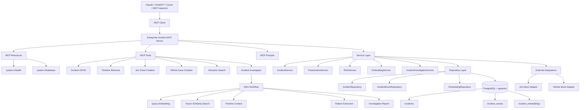

# Architecture Diagram



## Current Runtime Flow

```text
User query
   ↓
MCP Tool
   ↓
Semantic Search
   ↓
PostgreSQL + pgvector
   ↓
Incident + Timeline Retrieval
   ↓
RAG Context Builder
   ↓
Pattern Extraction
   ↓
Incident Investigation Report
```
